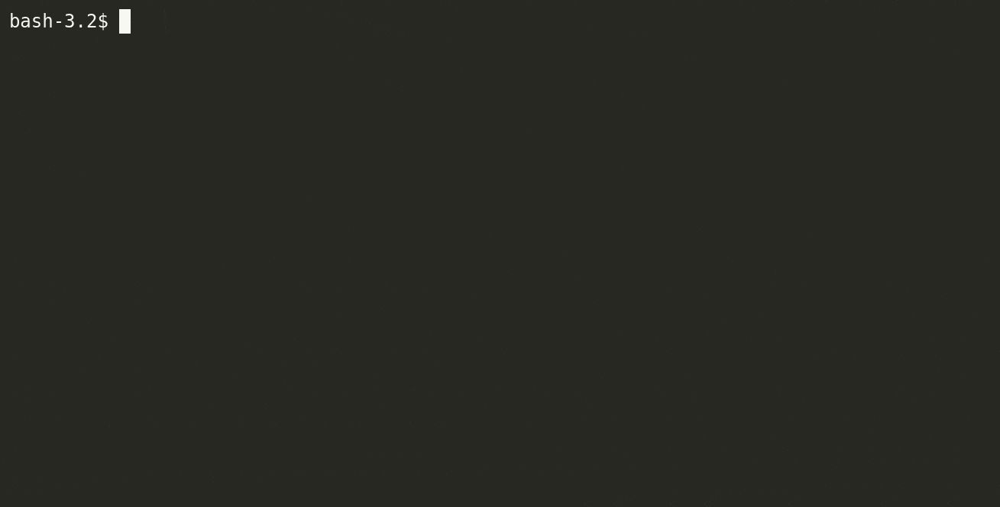

# WorkBench

**Status:** `Alpha`

  

WorkBench is a hierarchical environment manager for \*nix shells. It sources
shell-code distributed across multiple levels of a folder hierarchy and
invokes environments with the combination. Code could thus be implemented
to operate at different scopes, allowing clear overrides at each folder depth
and easy overall maintenance while managing several hundred environments.

## Documentation: [`wb.rtfd.io`](https://wb.rtfd.io)

Refer to the documentation for installation, conceptual overview,
usage and other reference material.

## Another env manager! Why?

WorkBench is _yet another_ tool to manage environments. It is similar to (and is heavily inspired by)
[Desk](https://github.com/jamesob/desk).

WorkBench differs from other environment management tools in the following ways:

1. Hierarchical by nature. Code, by design can be distributed across files to fit shallow or deep hierarchies.
1. Minimal features. WorkBench only generates and runs the enviroment. It doesn't lookup or parse env code.
1. **_Batteries not included_**. You build your own stack of functions to fit your needs.
1. Configurable invocation modes and entrypoints. Easy to switch contexts via `rcfiles`.
1. **_Bring your own security_**. Implement your own hook logic before execution. Skip if you don't need it (CI/automated envs)
1. Scriptable; with distinct exit codes. Write wrappers to re-execute env code in CI or other build environments.
1. Scalable. Designed to reduce maintenance effort when you scale up to hundreds of environments. Easy to organize.

WorkBench was built with a _less-is-more_ mindset. Docs were written with a _more-the-merrier_ mindset. :)

WorkBench does have a learning curve. You will need to go through the documentation to understand its capabilities.
It'd probably be some more time before you appreciate and exploit the hierarchy and flexibility of entrypoints.
Hopefully, by then, it'll grow on you.

## Alternatives

[Desk](https://github.com/jamesob/desk) is the best alternative. It comes with command & help lookup, and wider shell support out-of-the box.

Others tools that flirt with environments include [direnv](https://github.com/direnv/direnv), [modules](http://modules.sourceforge.net/), [asdf](https://github.com/asdf-vm/asdf)

## Development status and roadmap

WorkBench is currently _alpha_. While there really aren't any additional features planned, there may be some tweaks to improve how it interacts
with the environment code. The CLI and the exitCodes are stable.

WorkBench has _system tests_ written using Python3's unittest framework.
No additional python packages are necessary to run tests. Python 3.7 is preferred.

Following items will be taken up in the near future:

1. Code coverage (using [`bashcov`](https://github.com/infertux/bashcov))
1. Wider shell support. Currently WorkBench has been written with `bash` in mind. It may undergo changes to be more POSIX compliant and get
   tested against a wider range of shells.

## License

[`Apache 2.0`](LICENSE)
